# untitled-multiplayer-game
An untitled 2D multiplayer game built in Unity. Same build is used both for client and server. To run as server, start it with `-nographics`.

## 🏃‍➡️ How to run as server

### Linux
Start:
`./untitled-multiplayer-game.x86_64 -batchmode -nographics -logfile server.log`
 
 
Stop:
`Ctrl+C`

### Windows
Start:
`./untitled-multiplayer-game.exe -batchmode -nographics -logfile server.log`
 
 
Stop:
`Get-Process | ? -Property Name -Like '*untitled*' | Stop-Process`

## 🏗️ Architecture

### PlayerAnimation

The PlayerAnimation system is split into multiple specialized scripts for better organization and separation of concerns.

```mermaid
flowchart TB
    START@{ shape: sm-circ, label: "Small start" }

    START e7@--> PA(PlayerAnimation)
    
    subgraph test [Animations]
        direction TB
        PMA(PlayerMovementAnimation)
        PAA(PlayerAttackAnimation)
        PDA(PlayerDeathAnimation)
    end

    PAH{{PlayerAnimationHelpers}}

    PA e1@--> PMA 
    PA e2@--> PAA
    PA e3@--> PDA

    PAA e5@--> PAH
    PDA e6@--> PAH

    e1@{ animate: true }
    e2@{ animate: true }
    e3@{ animate: true }
    e5@{ animate: true }
    e6@{ animate: true }
    e7@{ animate: true }

    classDef EntryPoint fill:#520000
    class PA EntryPoint

    classDef Animations fill:#005228
    class PMA,PAA,PDA Animations

    classDef Helpers fill:#003852
    class PAH Helpers
```

### Script Responsibilities

| Script | Responsibility |
|--------|----------------|
| `PlayerAnimation` | Facade that delegates animation calls to specialized scripts |
| `PlayerMovementAnimation` | Handles idle/run animations |
| `PlayerAttackAnimation` | Handles attack animations |
| `PlayerDeathAnimation` | Handles death animation |
| `PlayerAnimationHelpers` | Utility class to make it possible to reuse common functions |